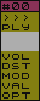
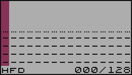
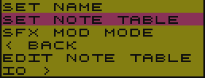

# SFX

> Na początku był efekt dżwiękowy (BOOM) :D
> Tak można by spekulować, po wnioskach naukowców w kwestii wielkiego wybuchu, który stworzył Nasz wszechświat ;)
> 
> Początki Music Makera sięgają silnika SFX, który powstał na potrzeby udźwiękowienia gry pisanej w Turbo Basicu. To właśnie tu powstała "zupa pierwotna", która ewoluowała do SFX Music Maker.

Popularnie nazywane Instrumentem, jednak jest to po prostu efekt dźwiękowy, a dokładniej, szereg definicji składających się na końcowy efekt, jakim jest słyszany dźwięk, czyli SFX.

[TOC]

## Jak powstaje SFX?

Definicję SFXa opisują trzy składowe:

- `VOL` - natężenie - to nic innego, jak głośność, a bardziej fachowo to amplituda dźwięku, a jeszcze bardziej fachowo, to wypadkowa amplitudy dźwięku
- `DST` - zniekształcenie - układ dźwiękowy POKEY oferuje kilka rodzajów zniekształceń, jakie może generować. [Zapoznaj się z pełnymi możliwościami POKEYa](https://en.wikipedia.org/wiki/POKEY)
- `MOD/VAL` modulacja - pozwala sterować odtwarzaniem SFXa oraz zmieniać jego częstotliwość. Ten parametr jest szerzej opisany w sekcji [Rodzaje modulacji](./Modulators.md#rodzaje-modulacji)

Każdy z nich, opisuje jeden krok obwiedni SFXa (patrz rysunek poniżej) Tych kroków można zdefiniować do 128.

## Tworzenie SFXa

W menu głównym, widnieje opcja `SFX`. Jest to moduł odpowiadający za tworzenie dzięków.

Po wybraniu tej opcji otwiera się widok edytora.

### Menu modułu SFX

Po lewej stronie znajduje się pasek menu (zdjęcie powyżej), w którym umieszczone są najistotniejsze opcje. 

Pierwszą z nich jest numer aktualnie wybranego SFXa `#00`. Korzystając z klawiszy strzałek __LEWO/PRAWO__, można sekwencyjnie go zmieniać. Naciskając klawisz __RETURN__ otworzy się lista ze wszystkimi (również niezdefiniowanymi) SFXami. Gwiazdka przy nazwie SFXa oznacza, że SFX jest zdefiniowany.
Obok numeru SFXa znajduje się jego nazwa. Poniżej tej opcji umieszczone są kolejno:

- `>>>` - przejście do trybu edycji
- `PLY` - przejście do trybu pianina
- `VOL`, `DST`, `MOD`, `VAL` - pozwalają szybko przejść do edycji składowej SFXa
- `OPT` - zawiera opcje konfiguracyjne SFXa

### Obszar edycji

Po prawej stronie paska menu SFX, widnieje obszar edycji. Znajdują się w nim:

- widok na obwiednie SFXa (obwiednia jest wizualizacją wartości składowej `VOL`)
- składowe definicji `VOL`, `DST`, `MOD`, `VAL`. 
- Linia informacyjna (rysunek poniżej) która zawiera:

- `HFD` - tryb modulacji zastosowany dla SFXa
- `000` - aktualna pozycja kursora edycji
- `128` - długości definicji SFXa

## Tryb edycji SFX

Po przejściu do trybu edycji, rzeczą na którą należy zwrócić uwagę przy wprowadzaniu zmian, jest aktualnie wybrana składowa edycji, tzn: `VOL`, `DST`, `MOD`, `VAL`. Zmianę składowej można dokonać naciskając klawisze strzałek __GÓRA/DÓŁ__.

Aby ustawić żądaną wartość składowej, można posłużyć się dwoma metodami:

1. Przytrzymując klawisz **CONTROL**, użyć klawiszy strzałek __GÓRA/DÓŁ__. Dokonamy sekwencyjnego wyboru wartości danej składowej w przedziale od `0` do `F` (tj. od 0 do 15 - zapis tej wartości odbywa się systemie heksadecymalnym)
2. Można również, szybko podać konkretną wartość, naciskając klawisze numeryczne od `0` do `9` oraz klawisze `A` do `F` (które odpowiadają wartością od 10 do 15)

Przemieszczanie kursora edycji odbywa się za pomocą klawiszy strzałek __LEWO/PRAWO__ i w ten sposób przemieszamy kursor o jedną pozycję (stosownie do kierunku).
Jest też możliwość szybkiego przemieszczania się w obrębie definicji. W tym celu należy nacisnąć dodatkowo klawisz __CONTROL__ wraz z kierunkiem przemieszczenia. Pozycja kursora będzie ulegała zmianie (stosownie do kierunku) o szerokość ekranu, tj. 16 punktów definicji SFXa widocznych na ekranie edycji.

#### Menu funkcji modulacji

W trybie edycji SFXa, składowe `MOD/VAL` zawierają informacje sterujące dla silnika SFX. Nie jest wymagana znajomość kodów, gdyż dostępne jest wygodne menu z listą funkcji. Dostęp do tego menu umożliwia wciśnięcie klawisza **RETURN** (bez względu na aktualnie wybraną składową definicji) 

Lista ta, będzie się różnić w zależności od trybu modulacji.

| Tryb        | DSD                                                          | HFD                                                          | MFD                                                          | NLM                                                          |
| ----------- | :----------------------------------------------------------- | :----------------------------------------------------------- | :----------------------------------------------------------- | :----------------------------------------------------------- |
| Pełna nazwa | Direct Set Divide                                            | High Frequency Divider                                       | Middle Frequency Divider                                     | Note Level Modulator                                         |
| Funkcje     |  |  |  |  |

Znaczenie poszczególnych funkcji jest następujące:

- `FREQ SET` - ustawia wartość dzielnika częstotliwości w zakresie 0 do 255
- `STOP SFX` - kończy przetwarzania SFXa
- `FREQ SHIFT` - zmienia względnie wartość dzielnika częstotliwości*
- `NOTE SHIFT` - zmienia względnie nutę o ilość półtonów
- `NOP` - No OPeration - brak operacji na SFXie
- `BACK >` - powrót do edycji SFXa
- `< EXIT` - wyjście z trybu edycji.

_*_ - zakres zmian zależny jest od wybranego trybu modulacji. Więcej na ten temat dowiesz się z [Tryby modulacji](./Modulators.md)

Automatycznie zaznaczana jest opcja, która jest w miejscu kursora edycji i ma to na celu, ułatwienie dokonywania zmian wartości aktualnej funkcji. Wystarczy wcisnąć dwa razy klawisz **RETURN**.

Po wybraniu jednej z opcji, wyświetlony zostanie monit w linii statusu o podanie wartości dla wybranej funkcji - zakres tej wartości zostanie wyświetlony na ekranie.

Po zaakceptowaniu klawiszem __RETURN__, program przetworzy wprowadzone informacje do składowych `MOD/VAL`.

## Tryb pianina

W tym trybie można przetestować stworzony dźwięk. Klawisze odpowiadające nutom rozłożone są na klawiaturze komputera zgodnie z poniższym rysunkiem:

Dodatkowo, za pomocą klawisza __TAB__ lub __SHIFT-TAB__ można zmieniać oktawę bazową, a naciskając klawisz __INVERS__ zmienimy tryb pracy pianina pomiędzy Single-Tone a Multi-Tone (bardziej kojarzony z Polifonią)

Tryb Multi-Tone charakteryzuje się odtwarzaniem dźwięku kolejno na kanałach 0, 1, 2, 3, 0, 1, 2... itd.

Aktualny tryb oznaczony jest literą `S` lub `M` po lewej stronie wizualizacji piania, tuż na cyfrą określającą bazową oktawę. Po przeciwnej stronie, znajduje się literowy wskaźnik (`A`,`B`,`C`,`D`) pokazujący zastosowaną tabele nut, a pod nim, cyfra określająca końcową oktawę.

Wyjście z trybu pianina następuje po naciśnięciu klawisza __ESC__

## Opcje SFX

W pasku menu, pod skrótem `OPT`, ukryte są opcje związane z ustawieniami aktualnie edytowanego SFXa.

- `SET NAME` - zmiana nazwy SFXa
- `SET NOTE TABLE` - ustawienie tablicy nut dla SFXa
- `SFX MOD MODE` - ustawienie trybu modulacji dla SFXa
- `< BACK` - wyjście z opcji
- `EDIT NOTE TABLE` - otwiera moduł edycji tablic nut (patrz sekcja [Edycja Tablic Nut](#Edycja-Tablic-Nut))
- `IO >` - operacje dyskowe

### SET NAME

`SET NAME`,  pozwala nadać nazwę dla aktualnie edytowanego SFXa. Nazwa może mieć maksymalnie 14 znaków. Nazwy nie podlegają weryfikacji pod kątem już istniejących (występujących) nazw.

### SET NOTE TABLE

Każdej definicji SFX można przypisać jedną z czterech tablic nut (więcej o tablicach nut w sekcji [Edycja Tablic Nut](#Edycja-Tablic-Nut))

Po wybraniu tej opcji, otworzy się lista z nazwami tablic.

### SET MOD MODE
Podobnie jak tablice nut, dla każdego SFXa można przypisać tzw. *tryb modulacji* (więcej na ten temat w sekcji [Rodzaje modulacji](./Modulators.md))

Po wejściu w opcję, otwiera się lista ze skrótami trybów.

Po otwarciu listy, zaznaczony zostanie tryb modulacji, jaki jest ustawiony dla aktualnie edytowanego SFXa.

> **UWAGA!** Zmiana trybu nie konwertuje definicji SFXa do wybranego trybu. **Należy wykonać ją samodzielnie.** Odtworzenie niedostosowanego SFXa może prowadzić do nieokreślonego zachowania się programu, <u>włącznie z jego zawieszeniem</u>.

### Edycja Tablic Nut

Ten moduł odpowiedzialny jest za dostosowanie tablic nut.

> **Tablica nut** - to zestaw wartości opisujących częstotliwość (dzielnik częstotliwości) dla każdej nuty. Dzięki tablicom, można dostroić brzmienie dźwięku.

Po lewej stronie znajduje się pasek menu, a w nim:

- `SET` - wybór edytowanej tablicy nut
- `>>>` - przejście do trybu edycji
- `OPT` - opcje modułu

#### Tryb edycji Tablic Nut

Obszar roboczy tego trybu zawiera (kolejno od góry)

- Aktualnie wybraną oktawę
- Wskaźniki precyzyjnego dostrojenia nuty
- Wartość zgrubna dostrojenia nuty (zapisna szesnastkowo)

W tym trybie wykorzystany jest **tryb piania**, tzn. klawiszami można wybrać edytowaną nutę, jednocześnie zostanie odtworzony dźwięk (aktualnie wybranego SFXa)

Wyboru nuty można też dokonać naciskając klawisze strzałek **LEWO/PRAWO** wybierając sekwencyjnie nuty - w tym przypadku dźwięk SFXa nie zostanie odtworzony.

Strojenie odbywa się za pomocą klawiszy strzałek **GÓRA/DÓŁ** - przy zmianie wartości dzielnika częstotliwości nie jest odtwarzany dźwięk SFXa.

Wyjście z trybu edycji następuje po naciśnięciu klawisza **ESC**

#### Opcje Tablic nut

W menu `OPT` zawarte są opcje umożliwiające:

- `SET TABLE NAME` - zmiana nazwy tablicy
- `< BACK` - wyjście z opcji
- `IO` - operacje dyskowe `LOAD` oraz `SAVE` pozwalające odpowiednio: wczytać lub zapisać definicję tablicy nut, wykorzystując do tego celu urządzenie zewnętrznę. Postępowanie w przypadku użycia tych opcji jest dokładnie takie samo jak dla opcji `SFX->IO`

### IO

#### LOAD

Pozwala wczytać definicję SFXa z urządzenia zewnętrznego. W tym celu, należy podać nazwę urządzenia oraz nazwę pliku, zawierającą definicję, np. `D:PIANO.SFX`

Nazwę można też wybrać z katalogu dysku, do którego dostęp uzyskamy wpisując tylko urządzenia, np: `D:`. Można też wprowadzić znaki uniwersalne (tzw. wildcards) które pozwolą zawęzić listę do, np. konkretnych rozszerzeń, np. `D:*.SFX`, `D:A*.*`, itp.

#### SAVE

Pozwala zapisać zdefiniowany SFX na urządzeniu zewnętrznym. Zasady postępowania w tej opcji są takie same jak dla `IO>LOAD`

