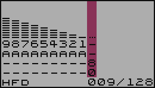

# SFX

> Na początku był efekt dżwiękowy (BOOM) :D
> Tak można by spekulować, po wnioskach naukowców w kwestii wielkiego wybuchu, który stworzył Nasz wszechświat ;)
> 
> Początki Music Makera sięgają silnika SFX, który powstał na potrzeby udźwiękowienia gry pisanej w Turbo Basicu. To właśnie tu powstała "zupa pierwotna", która ewoluowała do SFX Music Maker.

Popularnie nazywane Instrumentem, jednak jest to po prostu efekt dźwiękowy, a dokładniej, szereg definicji składających się na końcowy efekt, jakim jest SFX .

## Jak powstaje SFX?

Definicję SFXa opisują trzy elementy:

- `VOL` - natężenie - to nic innego, jak głośność, a bardziej fachowo to amplituda dźwięku, a jeszcze bardziej fachowo, to wypadkowa amplitudy dźwięku
- `DST` - zniekształcenie - układ dźwiękowy POKEY oferuje kilka rodzajów zniekształceń, jakie może generować. [Zapoznaj się z pełnymi możliwościami POKEYa](https://en.wikipedia.org/wiki/POKEY)
- `MOD/VAL` modulacja - ten paretr jest szerzej opisany w sekcji [Rodzaje modulacji](./modval_PL.md#rodzaje-modulacji)

Każdy z nich, opisuje jeden krok obwiedni SFXa (patrz rysunek poniżej) Tych kroków można zdefiniować do 128.

## Tworzenie SFXa

W menu głównym, widnieje opcja `SFX`. Jest to moduł odpowiadający za tworzenie dzięków.

Po wybraniu tej opcji, korzystając z klawiszy strzałek __LEWO/PRAWO__ i klawisza __RETURN__ otwiera się widok na edytor.

### Menu bar

Po lewej stronie znajduje się MenuBar, w którym umieszczone są najistotniejsze opcje. Przemieszczanie się pomiędzy nimi, odbywa się za pomocą klawiszy strzałek __GÓRA/DÓŁ__, a wyboru dokonasz klawiszem __RETURN__.

Pierwszą z nich jest `#00` i jest to numer aktualnie wybranego SFXa. Korzystając z klawiszy strzałek __LEWO/PRAWO__, można sekwencyjnie go zmieniać. Naciskając klawisz __RETURN__ otworzy się lista ze wszystkimi (również niezdefiniowanymi) SFXami.
Obok numeru `#00` znajduje się nazwa SFXa.

Tuż pod opcją `#00` umieszczone są:

- `>>>` - przejście do trybu edycji
- `PLY` - przejście do trybu pianina
- `VOL`, `DST`, `MOD`, `VAL` - pozwalają szybko przejść do edycji tego konkretnego elementu SFXa
- `OPT` - zawiera opcje konfiguracyjne SFXa

### Obszar edycji

Po stronie prawej ekranu, jest widok na obwiednie SFXa oraz jej elementy. Tuż pod nimi (na wysokości opcji `OPT`) znajduje się informacja o:
- trybie modulacji
- aktualnej pozycji kursora edycji
- długości definicji SFXa

## Tryb edycji SFX

Po przejściu do Trybu edycji (SFX->`>>>`) rzeczą na którą należy zwrócić uwagę przy wprowadzaniu zmian, jest aktualnie wybrany element edycji, tzn: `VOL`, `DST`, `MOD`, `VAL`. Zmiany tego elementu można dokonać naciskącjąc klawisz __TAB__ lub __SHIFT+TAB__, co powoduje sekwencyjne przełączenie pomiędzy tymi elementami.

Aby ustawić rządaną wartość elementu, można posłużyć się dwoma metodami:

1. Używając klawiszy strzałek __GÓRA/DÓŁ__ dokonujemy sekwencyjnego wyboru wartości danego elementu w przedziale od 0 do 15. Zapis tej wartości odbywa się systemie hexadecymalnym.
2. Można również szybko podać interesującą nas wartość naciskając klawisze numeryczne od 0 do 9 oraz klawisze A do F (które odpowiadają wartością od 10 do 15)

Przemieszczanie kursora edycji odbywa się za pomocą klawiszy strzałek __LEWO/PRAWO__ i w ten sposób przemieszamy kursor o jedną pozycję (stosownie do kierunku).
Jest też możliwość szybkiego przemieszczania się w obrębie definicji. W tym celu należy nacisnąć dodatkowo klawisz __CONTROL__ wraz z kierunkiem przemieszczenia (klawisze strzałek __LEWO/PRAWO__). Pozycja kursora będzie ulegała zmianie (stosownie do kierunku) o szerokość ekranu, tj. 16 punktów definicji SFXa widocznych na ekranie edycji.

## Tryb pianina

## Opcje SFX

W menu bar, pod skrótem `OPT`, ukryte są opcje związane z ustawieniami aktualnie edytowanego SFXa.

### SET NAME
`SET NAME`,  pozwala nadać nazwę dla aktualnie edytowanego SFXa. Nazwa może mieć maksymalnie 14 znaków. Nazwy nie podlegają weryfikacji pod kątem już istniejących (występujących) nazw.

### SFX MOD MODE
Ta opcja jest szerzej opisana w sekcji [Modulacja w progrmie](./modval_PL.md#modulacja-w-programie)

### IO>LOAD

### IO>SAVE
