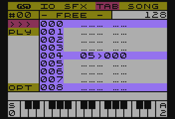

[TOC]

# TABy

W świecie trackerów, znane jako *Pattern* i pełnią dokładnie tą samą funkcję. Zawierają nuty i instrukcje opisujące jedną ścieżkę dźwiękową utworu. Dzięki takiemu podejściu, utwór może być bardziej skomplikowany i jednocześnie zajmować mniej miejsca.

## Cechy charakterystyczne dla TABów

Podstawową cechą w odróżnieniu od większości (znanych mi) Trackerów - gdzie *patterny* mają przeważnie stałą długość - TABy mogą mieć długość od 1 do 128 nut.

> Tak, wiem, potężny i naprawdę świetny Raster Music Tracker pozwa na zdefiniowanie do 256 nut, ale ta funkcjonalność bardziej pasuje do FUTURE COMPOSERa, gdzie niezależnie, każdy Pattern może mieć swoją własną długość.

Dodatkowo mogą też być zapętlane na dwa sposoby: funkcją skoku bezpośredniego i funkcją powtórzenia, a wszystko to wewnątrz TABa.

Kolejną cechą charakterystyczną jest, możliwość używania nie tylko nut, ale i także  wartości dzielnika częstotliwości.

Inną cechą, której nie spotkałem w innych, znanych mi programach typu Tracker, jest możliwość nazywania TABów. Tak, w SFXMM można je nazwać.

Szerszy opis funkcji TAB znajdziesz w sekcji [Funkcje TAB](#funkcje-tab)

## Co piszczy w module TAB?

**SFX Music Maker**, pozwala na zdefiniowanie do 64 niepowtarzalnych TABów, z których każdy możesz nazwać, aby się nie pogubić :F

Widok modułu TAB jest bardzo prosty i przedstawia się następująco:

Po lewej stronie ekranu widnieje pasek menu, a w nim, pierwszą pozycją jest numer aktualnie wybranego TABa i tuż obok, jest jego nazwa. Zaraz za nazwą, jest informacja o długości aktualnego TABa.

Pod numerem TABa, są następujące opcje:

- `>>>` - przechodzi do trybu edycji TABa
- `PLY` - odtworzenie TABa
- `OPT` - tu kryje się opcja ustawienia nazwy TABa

Przemieszczanie pomiędzy poszczególnymi opcjami menu, odbywa się za pomocą klawiszy strzałek __GÓRA/DÓŁ__, a wyboru opcji dokonasz klawiszem __RETURN__.

## Lista TABów

Będąc kursorem na numerze aktualnego TABa (pasek menu TAB), klawiszami strzałek __LEWO/PRAWO__ można zmieniać numer, jednocześnie mając podgląd na fragment definicji TABa w obszarze edycji.

Naciskając klawisz __RETURN__ pokazana zostanie lista wszystkich TABów, wraz z nazwami. Gwiazdką obok nazwy zostaną oznaczone te TABy, które zawierają treść. 
Wyboru dokonasz przemieszczając się klawiszami strzałek __GÓRA/DÓŁ__. Akceptacja wyboru odbywa się klawiszem __RETURN__.

## Edycja TABów

Do trybu edycji przejdziesz wybierając opcję `>>>` i naciskając klawisz __RETURN__.
Kursor wskazuje na aktualnie edytowany wiersz TABa, a jego przemieszczanie odbywa się za pomocą klawiszy strzałek __GÓRA/DÓŁ__ lub **CONTROL+GÓRA/DÓŁ**

Wprowadzanie nut odbywa się za pośrednictwem wirtualnego pianina, którego zasada działania została opisana w sekcji [SFX - Tryb pianina](./SFX Module.md#tryb-pianina)

Klawiszami strzałek **LEWO/PRAWO** można zmienić aktualnie używany SFX, a informacja o nim ukaże się w linii statusu (nad wizualizacją pianina)

Trzymając **CONTROL** i używając strzałek **LEWO/PRAWO** można przełączać aktualnie edytowany TAB, a **CONTROL+RETURN** pozwala wybrać z listy TAB do edycji.

Klawisz **RETURN** otwiera menu **Funkcji TAB** opisane w następnej sekcji.

Wyjście z edycji umożliwia klawisz **ESC**

## Funkcje TAB

Funkcje TAB to jedna z cech charakterystycznych SFX Music Makera (patrz sekcja [Cechy charakterystyczne dla TABów](#cechy-charakterystyczne-dla-tabów))

Każdy TAB może być definiowany z użyciem następujących funkcji:

- nuty - to raczej nie ulega wątpliwości, najważniejsza funkcja w TABie :D
- `TABEND` - pozwala na zakończenie TABa w dowolnym miejscu
- `JUMP TO` - funkcja skoku bezpośredniego
- `REPEAT` - funkcja powtórzenia
- `NOTE VALUE` - tą funkcją też można tworzyć melodię, jednak jej zapis to wartość dzielnika częstotliwości i jest dziesiętny.
- `NOP` (No OPeration) - po prostu brak operacji.

 

### Wprowadzanie funkcji

Aby móc wstawić funkcję TABa, naciśnij __RETURN__, będąc w trybie edycji. Pokaże się lista dostępnych opcji, a aktualnie wybrana, będzie opcją spod kursora. Więc, aby szybko zmienić parametry funkcj,i wystarczy dwa razy wcisnąć __RETURN__.

Akceptując wprowadzenie funkcji, która wymaga podania parametru/ów, użytkownik będzie informowany w linii statusu o tym, jaką wartość ma wprowadzić oraz o zakresie tej wartości.

Podanie wartości spoza zakresu, skutkuje ponowieniem wprowadzenia. Klawisz **ESC** anuluje wprowadzanie funkcji.

#### TABEND
Tą funkcją zakończyć można definicję TABa.
Istotną cechą stosowania funkcji `TABEND` jest zmniejszenie zapotrzebowania na pamięć, gdyż kończąc nią definicję TABa, określamy jego długość i ilość zużytej pamięci.

Tak wygląda w zapisie:

Jak widać na powyższym obrazku, długość (oznaczona w prawym górnym rogu) jest ustawiona na 5 wierszy, to powoduje, że TAB w pamięci zajmuje tylko 10 bajtów (po dwa bajty na linię) a nie 256 - w przypadku nie zastosowania `TABEND`.

#### JUMP TO
Jedna z dwóch funkcji pozwalających na zapętlenie TABa.

Funkcja `JUMP TO` wykonuje skok do podanej pozycji w TABie. Takie zapętlenie będzie wykonywane bez końca.

Tak wygląda w zapisie:

Po wybraniu tej funkcji, użytkownik zostanie poproszony o podanie numeru wiersza skoku.

#### REPEAT
Kolejna funkcja służąca do zapętlania.

Tym razem, `REPEAT` poprzez fakt, że oprócz miejsca skoku, zawiera dodatkowy parametr określający ilość powtórzeń, powtarzać będzie "blok" żądaną ilość razy, po czym przejdzie dalej.

Wygląd w zapisie:

Po wybraniu funkcji, poproszony zostaniesz najpierw o:

- podanie ilości powtórzeń
- miejsca skoku

#### NOTE VALUE

Funkcja ustawiająca bezpośrednio wartość dzielnika częstotliwości układu POKEY.
Pozwala to na "dostrajanie fałszujących dżwięków" lub wręcz specjalne fałszowanie.

> Nie które kombinacje zniekształceń i dzielników częstotliwości generowanych przez POKEY dźwięków, ulegają dodatkowym zniekształceniom, które w efekcie mogą powodować u słuchającego wrażenie fałszowania.

Ułatwieniem w dostrajaniu jest to, że jeżeli zastosujemy tą funkcję na wierszu w której jest zapisana nuta, zostanie automatycznie podana wartość dzielnika częstotliwości odpowiadająca nucie (wartość z tabeli nut użytego SFXa), którą ostatecznie można skorygować.

Wybór tej funkcji, powoduje monit o podanie dwóch wartości:

- wartość dzielnika częstotliwości
- numer SFXa

#### NOTE OFF

Funkcja bezparametrowa. Powoduje wyłączenie aktualnie odtwarzanego SFXa.

