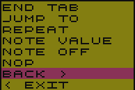
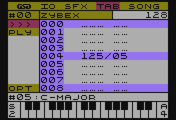

# TABs

In the tracker world, known as *Patterns* and serve exactly the same function. They contain notes and instructions that describe one track of a song. This approach allows the track to be more complex while taking up less space.

## Features of TABs

A basic feature unlike most (that I know of) Trackers - where *patterns* are mostly fixed length - TABs can be from 1 to 128 notes long.

> Yes, I know, the powerful and really great Raster Music Tracker allows to define up to 256 notes, but this functionality is more suitable for FUTURE COMPOSER, where independently, each Pattern can have its own individual length.

In addition, they can also be looped in two ways: a direct jump function and a repeat function, with everything inside a TAB.

> The only Tracker I know of that had similar functionality at the Pattern level would be FUTURE COMPOSER.

Another feature is the ability to use not only notes, but also frequency divider values.

One more feature that I haven't found in other Tracker programs I know, is the ability to name TABs. Yes, in SFXMM you can name them.

You can find a more extensive description of TAB functions in the *TAB Functions* section.

## What's squeaky in the TAB module?

SFX Music Maker, allows you to define up to 100 different, unique :P TABs, each of which you can name so you don't get lost :F

The TAB module view is very simple and is as follows:

On the left side of the screen there is a menu bar, and in it, the first item is the number of currently selected TAB and next to it, there is its name ^_^. Just after the name, there is the information about the length of current TAB.

Under TAB number, there are following options:

- `>>>` - goes to TAB editing mode.
- `PLY` - playing the TAB
- `OPT` - here is the option to set the TAB name

Under OPT is the number of the currently selected SFX, along with its name.
Move between the various bar menu options using the __UP/DOWN__ arrow keys, and select an option with the __RETURN__ key.

## TAB List

While the cursor is on the number of the current TAB, the __LEFT/RIGHT__ arrow keys can be used sequentially to change the number while simultaneously viewing a portion of the TAB definition in the edit area.

Pressing the __RETURN__ key will show a list of all (even undefined) TABs, along with their names.
You can choose by pressing the __UP/DOWN__ arrow keys. Accept the choice by pressing the __RETURN__ key.

## Edit TABs

You enter the editing mode by selecting `>>>` and pressing the __RETURN__ key.
The cursor points to the TAB line currently being edited, and is moved using the __UP/DOWN__ arrow keys.

### Note keys

Almost every TRACKER has exactly the same note key layout.

> I do not know which program introduced this layout first, but it is standard even in the PC/MAC world.

The key layout is as follows:

As you can see in the image above, it covers almost 2 and a half octaves, and the scale that can be played on the SFXMM is 5 and 1/3 octaves.

Changing the octave range can be realized by using the __SHIFT+ UP/DOWN__ keys by switching the range sequentially higher/lower respectively.

## TAB Features

TAB functions are one of the features of SFX Music Maker (see section *TAB Features*).

Each TAB can be defined with the following functions:

- notes - this is rather unquestionably, the most important function in a TAB :D
- `TABEND` - allows to end a TAB anywhere
- `JUMP TO` - direct jump function
- `REPEAT` - repeat function
- `NOTE VALUE` - with this function you can also create a melody, but its notation is the value of frequency divider and it is decimal.
- `SFX CHANGE` - function changing the sound of the currently played song without changing its frequency.
- `NOP` (No OPeration) - simply no operation.

 

To be able to insert a TAB function, press __RETURN__ while in edit mode. A list of available options will be shown, and the currently selected option will be the one under the cursor. So, to quickly change the parameters of the currently selected function just press __RETURN__ twice.

### TABEND
Use this function to end the definition of a TAB.
An important aspect of using the `TABEND` function is that it reduces memory requirements, because by terminating a TAB definition with it, we specify its length and the amount of memory used.

It looks like this in notation:

As you can see in the above image, the length (marked in the upper right corner) is set to 5 (lines), this causes the TAB in memory to take up only 10 bytes (two bytes per line) rather than 256 - in case `TABEND` is not used.

### JUMP TO
One of two functions that allow you to loop a TAB.

The `JUMP TO` function will jump to the specified position in the TAB until, fully synchronized with the rest of the tracks, i.e. until all tracks in the SONG notation end at exactly the same time.

It is how it looks in the notation:

### REPEAT
Another function used for looping.

This time, `REPEAT` by the fact that in addition to the jump location, it contains an additional parameter specifying the number of repetitions, will repeat the "block" that number of times. After that, it will move on, not paying attention to synchronization with the rest of the tracks.

View in notation:

### NOTE VALUE

Function which directly sets the value of the frequency divider of the POKEY circuit.
This allows you to "tune out false sounds" or even special falsification.

> Some combinations of distortions and frequency divisors of the sounds generated by the POKEY, are affected by additional distortions, which may cause the listener to experience false sounds.

### SFX CHANGE

This is a "not a function" :P

Allows you to change the SFX currently playing, without causing changes on the pitch side of the currently playing sound. In short, it changes the SFX, it does not change the note.

