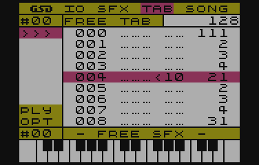

# TABy

W świecie trackerów, znane jako *Pattern* i pełnią dokładnie tą samą funkcję. Zawierają nuty i instrukcje opisujące jedną ścieżkę dźwiękową utworu. Dzięki takiemu podejściu, utwór może być bardziej skomplikowany i jednocześnie zajmować mniej miejsca.

## Cechy charakterystyczne dla TABów

Podstawową cechą w odróżnieniu od większości (znanych mi) Trackerów - gdzie *patterny* mają przeważnie stałą długość - TABy mogą mieć długość od 1 do 128 nut.

> Tak, wiem, potężny i naprawdę świetny Raster Music Tracker pozwa na zdefiniowanie do 256 nut, ale ta funkcjonalność bardzie pasuje do FUTURE COMPOSERa, gdzie niezależnie, każdy Pattern może mieć swoją własną, indywidualną długość.

Dodatkowo mogą też być zapętlane na dwa sposoby: funkcją skoku bezpośredniego i funkcją powtórzenia, z wszystko to wewnątrz TABa.

> Jedyny znan mi Tracker, który posiadał podobną funkcjonalność na poziomie Patternów, by FUTURE COMPOSER.

Kolejną cechą charakterystyczną jest, możliwość używania nie tylko nut, ale i także  wartości dzielnika częstotliwości.

Inną cechą, której nie spotkałem w innych, znanych mi programach typu Tracker, jest możliwość nazywania TABów. Tak, w SFXMM można je nazwać.

Szerszy opis funckji TAB znajdziesz w sekcji *Funkcje TAB*

## Co piszczy w module TAB?

SFX Music Maker, pozwala na zdefiniowanie do 100 różnych, niepowtarzalnych :P TABów, z których każdy możesz nazwać, aby się nie pogubić :F

Widok modułu TAB jest bardzo prosty i przedstawia się następująco:

Po lewej stronie ekranu widnieje menu bar, a w nim, pierwszą pozycją jest numer aktualnie wybranego TABa i tuż obok, jest jego nazwa ^_^. Zaraz za nazwą, jest informacja o długości aktualnego TABa.

Pod numerem TABa, są następujące opcje:

- `>>>` - przechodzi do trybu edycji TABa
- `PLY` - odtworzenie TABa
- `OPT` - tu kryje się opcja ustawienia nazwy TABa

Pod `OPT` jest numer aktualnie wybranego SFXa, wraz z jego nazwą.

Przemieszczanie pomiędzy poszczególnymi opcjami menu bar odbywa się za pomocą klawiszy strzałek __GÓRA/DÓŁ__, a wyboru opcji dokonasz klawiszem __RETURN__.

## Lista TABów

Będąc kursorem na numerze aktualnego TABa, klawiszami strzałek __LEWO/PRAWO__ sekwencyjnie można zmieniać numer, jednocześnie mając podgląd na fragment definicji TABa w obszarze edycji.

Naciskając klawisz __RETURN__ pokazana zostanie lista wszystkich (nawet nie zdefiniowanych) TABów, wraz z nazwami.
Wyboru dokonasz przemieszczając się klawiszami strzałek __GÓRA/DÓŁ__. Akceptacja wyboru odbywa się klawiszem __RETURN__.

## Edycja TABów

Do trybu edycji przejdziesz wybierając opcję `>>>` i naciskając klawisz __RETURN__.
Kursor wskazuje na aktualnie edytowaną linię TABa, a jego przemieszczanie odbywa się za pomocą klawiszy strzałek __GÓRA/DÓŁ__.

### Klawisze nut

Praktycznie każdy Tracker posiada dokładnie taki sam układ klawiszy nut.

> Nie wiem, który program wprowadził ten układ jako pierwszy, jednak jest on standartem nawet w świecie PC/MAC.

Układ klawiszy jest następujący:

Jak widać na powyższym obrazku, obejmuje on prawie 2 i pół oktawy, a skala, jaką można zagrać na SFXMM to 5 i 1/3 oktawy.

Zmiany zakresu oktaw dokonać można używając klawiszy __SHIFT+GÓRA/DÓŁ__ przełączając zakres sekwencyjnie odpowiednio wyżej/niżej.

## Funkcje TAB

Funkcje TAB to jedna z cech charakterystycznych SFX Music Makera (patrz sekcja *Cechy charakterystyczne dla TABów*)

Każdy TAB może być definiowany z użyciem następujących funkcji:

- nuty - to raczej nie ulega wątpliwości, najważniejsza funkcja w TABie :D
- `TABEND` - pozwala na zakończenie TABa w dowolnym miejscu
- `JUMP TO` - funkcja skoku bezpośredniego
- `REPEAT` - funkcja powtórzenia
- `NOTE VALUE` - tą funkcją też można tworzyć melodię, jednak jej zapis to wartość dzielnika częstotliwości i jest dziesiętny.
- `SFX CHANGE` - funkcja zmieniająca brzmienie aktualnie "granego" dziwięku, bez zmiany jego częstotliwości.
- `NOP` (No OPeration) - po prostu brak operacji.

 

Aby móc wstawić funckję TABa, naciśnij __RETURN__, będąc w trybie edycji. Pokaże się lista dostępnych opcji, a aktualnie wybrana, będzie opcją spod kursora. Więc, aby szybko zmienić parametry aktualnie wybranej funkcji wystarczy dwa razy wcisnąć __RETURN__.

### TABEND
Tą funkcją zakończyć można definicję TABa.
Istotną cechą stosowania funkcji `TABEND` jest zmniejszenie zapotrzebowania na pamięć, gdyż kończąc nią definicję TABa, określamy jego długość i ilość zużytej pamięci.

Tak wygląda w zapisie:

Jak widać na powyższym obrazku, długość (oznaczona w prawym górnym rogu) jest ustawiona na 5 (linii), to powoduje, że TAB w pamięci zajmuje tylko 10 bajtów (po dwa bajty na linię) a nie 256 - w przypadku nie zastosowania `TABEND`.

### JUMP TO
Jedna z dwóch funkcji pozwalających na zapętlenie TABa.

Funkcja `JUMP TO` będzie wykonywała skok do podanej pozycji w TABie do momentu, pełnej synchronizacji z resztą ścieżek, tzn. aż wszystkie ścieżki w zapisie SONG skończą się dokładnie w tym samym czasie.

Tak wygląda w zapisie:

### REPEAT
Kolejna funkcja służąca do zapętlania.

Tym razem, `REPEAT` poprzez fakt, że oprócz miejsca skoku, zawiera dodatkowy parametr określający ilość powtórzeń, powtarzać będzie "blok" tą ilość razy. Po czym przejdzie dalej, nie zwracając uwagi na synchronizację z resztą ścieżek.

Wygląd w zapisie:

### NOTE VALUE

Funkcja ustawiająca bezpośrednio wartość dzielnika częstotliwości układu POKEY.
Pozwala to na "dostrajanie fałszujących dżwięków" lub wręcz specjalne fałszowanie.

> Nie które kombinacje zniekształceń i dzielników częstotliwości generowanych przez POKEY dźwięków, ulegają dodatkowym zniekształceniom, które w efekcie mogą powodować u słuchającego wrażenie fałszowania.

### SFX CHANGE

To funkcja "Nie funkcja" :P

Pozwala zmieniać aktualnie grający SFX, nie powodując zmian po stronie wysokości aktualnie odtwarzanego dźwięku. Mówiąc krótko, zmienia SFX, nie zmienia nuty.

