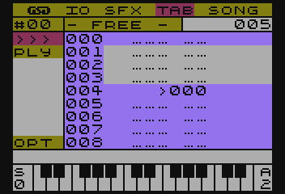

# SFX MUSIC MAKER (aka SFX-TRACKER)

To program na 8-bitowe komputery ATARI pozwalający tworzyć melodie, które później można wykorzystać w innych produkcjach.

Do odtwarzania dźwięków oraz melodi, wykorzystany jest autorski silnik dźwiękowy o nazwie **SFX-Engine**, którego głównym założeniem jest:

Jak największa elastyczność w dostosowaniu przez użytkownika przy zachowaniu optymalnej wydajności.

## INSTRUKCJA OBSŁUGI PROGRAMU

[TOC]

# Wymagania

Do prawidłowej pracy wymagany jest:

- mikrokomputer ATARI z procesorem 6502 (lub kompatybilnym)
- 64 KB pamięci RAM
- Stacja dysków lub inny napęd, pozwalający na swobodny dostęp do danych
- Dyskietka z programem lub obraz dyskietki
- Zapoznanie się instrukcją
- Słuch muzyczny i chęci do tworzenia :smile:

Program można też uruchomić na emulatorze tego mikrokomputera. Do tego celu wymagany jest obraz dysketki oraz zainstalowany i skonfigurowany program emulatora.

# Uruchomienie

## Prawdziwy sprzęt

TO DO

## Emulator

TO DO

# Podstawy obsługi

Pisząc SFXMM dążyłem przede wszystkim do prostej i czytelnej obsługi. Stąd moduły są do siebie podobne w wyglądzie jak i obsłudze.

## Sterowanie

Generalnie, wybór opcji w programie odbywa się za pomocą klawiszy kursora (strzałek) i jest (mam nadzieję) bardzo intuicyjne, a ich akceptacja odbywa się klawiszem **RETURN**

Z opcji można wyjść używając klawisz **ESC**.

W listach można się szybko przemieszczać o ilości elementów listy widocznych na ekranie, trzymając klawisz **CONTROL** oraz używając klawiszy strzałek.

# Moduł GSD

## THEME

W tym miejscu można wybrać schemat kolorystyczny z listy sześciu domyślnie wczytanych przy uruchamianiu programu. Lista schematów mieści się w pliku `DEFAULTH.EME`.

TO DO

### SAVE DEFAULT

Zapisuje aktualny zestaw tematów wraz z aktualnie wybranym na urządzeniu zewnętrznym.

Zapis odbywa się do pliku o nazwie `DEFAULTH.EME` . Użytkownik zostanie poproszony o potwierdzenie nadpisania tego pliku.

### LOAD THEME

Pozwala wczytać zestaw tematów kolorystycznych z urządzenia zewnętrznego.

# Moduł IO

TO DO

## LOAD/SAVE

TO DO

## NEW

TO DO

## QUIT

TO DO

# Moduł SFX

> Na początku był efekt dżwiękowy (BOOM) :D
> Tak można by spekulować, po wnioskach naukowców w kwestii wielkiego wybuchu, który stworzył Nasz wszechświat ;)
>
> Początki Music Makera sięgają silnika SFX, który powstał na potrzeby udźwiękowienia gry pisanej w Turbo Basicu. To właśnie tu powstała "zupa pierwotna", która ewoluowała do SFX Music Maker.

Popularnie nazywane Instrumentem, jednak jest to po prostu efekt dźwiękowy, a dokładniej, szereg definicji składających się na końcowy efekt, jakim jest słyszany dźwięk, czyli SFX.

## Jak powstaje SFX?

Definicję SFXa opisują trzy składowe:

- `VOL` - natężenie - to nic innego, jak głośność, a bardziej fachowo to amplituda dźwięku, a jeszcze bardziej fachowo, to wypadkowa amplitudy dźwięku
- `DST` - zniekształcenie - układ dźwiękowy POKEY oferuje kilka rodzajów zniekształceń, jakie może generować. [Zapoznaj się z pełnymi możliwościami POKEYa](https://en.wikipedia.org/wiki/POKEY)
- `MOD/VAL` modulacja - pozwala sterować odtwarzaniem SFXa oraz zmieniać jego częstotliwość. Ten parametr jest szerzej opisany w sekcji [Rodzaje modulacji](#rodzaje-modulacji)

Każdy z nich, opisuje jeden krok obwiedni SFXa (patrz rysunek poniżej) Tych kroków można zdefiniować do 128.

## Tworzenie SFXa

W menu głównym, widnieje opcja `SFX`. Jest to moduł odpowiadający za tworzenie dzięków.

Po wybraniu tej opcji otwiera się widok edytora.

### Menu modułu SFX

Po lewej stronie znajduje się pasek menu (zdjęcie powyżej), w którym umieszczone są najistotniejsze opcje. 

Pierwszą z nich jest numer aktualnie wybranego SFXa `#00`. Korzystając z klawiszy strzałek __LEWO/PRAWO__, można sekwencyjnie go zmieniać. Naciskając klawisz __RETURN__ otworzy się lista ze wszystkimi (również niezdefiniowanymi) SFXami. Gwiazdka przy nazwie SFXa oznacza, że SFX jest zdefiniowany.
Obok numeru SFXa znajduje się jego nazwa. Poniżej tej opcji umieszczone są kolejno:

- `>>>` - przejście do trybu edycji
- `PLY` - przejście do trybu pianina
- `VOL`, `DST`, `MOD`, `VAL` - pozwalają szybko przejść do edycji składowej SFXa
- `OPT` - zawiera opcje konfiguracyjne SFXa

### Obszar edycji

Po prawej stronie paska menu SFX, widnieje obszar edycji. Znajdują się w nim:

- widok na obwiednie SFXa (obwiednia jest wizualizacją wartości składowej `VOL`)
- składowe definicji `VOL`, `DST`, `MOD`, `VAL`. 
- Linia informacyjna (rysunek poniżej) która zawiera:

- `HFD` - tryb modulacji zastosowany dla SFXa
- `000` - aktualna pozycja kursora edycji
- `128` - długości definicji SFXa

## Tryb edycji SFX

Po przejściu do trybu edycji, rzeczą na którą należy zwrócić uwagę przy wprowadzaniu zmian, jest aktualnie wybrana składowa edycji, tzn: `VOL`, `DST`, `MOD`, `VAL`. Zmianę składowej można dokonać naciskając klawisze strzałek __GÓRA/DÓŁ__.

Aby ustawić żądaną wartość składowej, można posłużyć się dwoma metodami:

1. Przytrzymując klawisz **CONTROL**, użyć klawiszy strzałek __GÓRA/DÓŁ__. Dokonamy sekwencyjnego wyboru wartości danej składowej w przedziale od `0` do `F` (tj. od 0 do 15 - zapis tej wartości odbywa się systemie heksadecymalnym)
2. Można również, szybko podać konkretną wartość, naciskając klawisze numeryczne od `0` do `9` oraz klawisze `A` do `F` (które odpowiadają wartością od 10 do 15)

Przemieszczanie kursora edycji odbywa się za pomocą klawiszy strzałek __LEWO/PRAWO__ i w ten sposób przemieszamy kursor o jedną pozycję (stosownie do kierunku).
Jest też możliwość szybkiego przemieszczania się w obrębie definicji. W tym celu należy nacisnąć dodatkowo klawisz __CONTROL__ wraz z kierunkiem przemieszczenia. Pozycja kursora będzie ulegała zmianie (stosownie do kierunku) o szerokość ekranu, tj. 16 punktów definicji SFXa widocznych na ekranie edycji.

#### Menu funkcji modulacji

W trybie edycji SFXa, składowe `MOD/VAL` zawierają informacje sterujące dla silnika SFX. Nie jest wymagana znajomość kodów, gdyż dostępne jest wygodne menu z listą funkcji. Dostęp do tego menu umożliwia wciśnięcie klawisza **RETURN** (bez względu na aktualnie wybraną składową definicji) 

Lista ta, będzie się różnić w zależności od trybu modulacji.

| Tryb        | DSD               | HFD                    | MFD                      | NLM                  |
| ----------- | :---------------- | :--------------------- | :----------------------- | :------------------- |
| Pełna nazwa | Direct Set Divide | High Frequency Divider | Middle Frequency Divider | Note Level Modulator |
| Funkcje     | `FREQ SET`        | `STOP SFX`             | `STOP SFX`               | `STOP SFX`           |
|             | `BACK >`          | `FREQ SHIFT`           | `JUMP TO`                | `JUMP TO`            |
|             | `< EXIT`          | `NOP`                  | `FREQ SHIFT`             | `FREQ SHIFT`         |
|             |                   | `BACK >`               | `NOP`                    | `NOTE SHIFT`         |
|             |                   | `< EXIT`               | `BACK >`                 | `NOP`                |
|             |                   |                        | `< EXIT`                 | `BACK >`             |
|             |                   |                        |                          | `< EXIT`             |

Znaczenie poszczególnych funkcji jest następujące:

- `FREQ SET` - ustawia wartość dzielnika częstotliwości w zakresie 0 do 255
- `STOP SFX` - kończy przetwarzania SFXa
- `JUMP TO` - wykonuje skok w obrębie SFXa (zapętla go)
- `FREQ SHIFT` - zmienia względnie wartość dzielnika częstotliwości*
- `NOTE SHIFT` - zmienia względnie nutę o ilość półtonów
- `NOP` - No OPeration - brak operacji na SFXie
- `BACK >` - powrót do edycji SFXa
- `< EXIT` - wyjście z trybu edycji.

_*_ - zakres zmian zależny jest od wybranego trybu modulacji. Więcej na ten temat dowiesz się z [Rodzaje modulacji](#rodzaje-modulacji)

Automatycznie zaznaczana jest opcja, która jest w miejscu kursora edycji i ma to na celu, ułatwienie dokonywania zmian wartości aktualnej funkcji. Wystarczy wcisnąć dwa razy klawisz **RETURN**.

Po wybraniu jednej z opcji, wyświetlony zostanie monit w linii statusu o podanie wartości dla wybranej funkcji - zakres tej wartości zostanie wyświetlony na ekranie.

Po zaakceptowaniu klawiszem __RETURN__, program przetworzy wprowadzone informacje do składowych `MOD/VAL`.

## Tryb pianina

W tym trybie można przetestować stworzony dźwięk. Klawisze odpowiadające nutom rozłożone są na klawiaturze komputera zgodnie z poniższym rysunkiem:

Dodatkowo, za pomocą klawisza __TAB__ lub __SHIFT-TAB__ można zmieniać oktawę bazową, a naciskając klawisz __INVERS__ zmienimy tryb pracy pianina pomiędzy Single-Tone a Multi-Tone (bardziej kojarzony z Polifonią)

Tryb Multi-Tone charakteryzuje się odtwarzaniem dźwięku kolejno na kanałach 0, 1, 2, 3, 0, 1, 2... itd.

Aktualny tryb oznaczony jest literą `S` lub `M` po lewej stronie wizualizacji piania, tuż na cyfrą określającą bazową oktawę. Po przeciwnej stronie, znajduje się literowy wskaźnik (`A`,`B`,`C`,`D`) pokazujący zastosowaną tabele nut, a pod nim, cyfra określająca końcową oktawę.

Wyjście z trybu pianina następuje po naciśnięciu klawisza __ESC__

## Opcje SFX

W pasku menu, pod skrótem `OPT`, ukryte są opcje związane z ustawieniami aktualnie edytowanego SFXa.

- `SET NAME` - zmiana nazwy SFXa
- `SET NOTE TABLE` - ustawienie tablicy nut dla SFXa
- `SFX MOD MODE` - ustawienie trybu modulacji dla SFXa
- `< BACK` - wyjście z opcji
- `EDIT NOTE TABLE` - otwiera moduł edycji tablic nut (patrz sekcja [Edycja Tablic Nut](#Edycja-Tablic-Nut))
- `IO >` - operacje dyskowe

### SET NAME

`SET NAME`,  pozwala nadać nazwę dla aktualnie edytowanego SFXa. Nazwa może mieć maksymalnie 14 znaków. Nazwy nie podlegają weryfikacji pod kątem już istniejących (występujących) nazw.

### SET NOTE TABLE

Każdej definicji SFX można przypisać jedną z czterech tablic nut (więcej o tablicach nut w sekcji [Edycja Tablic Nut](#Edycja-Tablic-Nut))

Po wybraniu tej opcji, otworzy się lista z nazwami tablic.

### SET MOD MODE

Podobnie jak tablice nut, dla każdego SFXa można przypisać tzw. *tryb modulacji* (więcej na ten temat w sekcji [Rodzaje modulacji](#rodzaje-modulacji))

Po wejściu w opcję, otwiera się lista ze skrótami trybów.

Po otwarciu listy, zaznaczony zostanie tryb modulacji, jaki jest ustawiony dla aktualnie edytowanego SFXa.

> **UWAGA!** Zmiana trybu nie konwertuje definicji SFXa do wybranego trybu. **Należy wykonać ją samodzielnie.** Odtworzenie niedostosowanego SFXa może prowadzić do nieokreślonego zachowania się programu, <u>włącznie z jego zawieszeniem</u>.

### Edycja Tablic Nut

Ten moduł odpowiedzialny jest za dostosowanie tablic nut.

> **Tablica nut** - to zestaw wartości opisujących częstotliwość (dzielnik częstotliwości) dla każdej nuty. Dzięki tablicom, można dostroić brzmienie dźwięku.

Po lewej stronie znajduje się pasek menu, a w nim:

- `SET` - wybór edytowanej tablicy nut
- `>>>` - przejście do trybu edycji
- `OPT` - opcje modułu

#### Tryb edycji Tablic Nut

Obszar roboczy tego trybu zawiera (kolejno od góry)

- Aktualnie wybraną oktawę
- Wskaźniki precyzyjnego dostrojenia nuty
- Wartość zgrubna dostrojenia nuty (zapisna szesnastkowo)

W tym trybie wykorzystany jest **tryb piania**, tzn. klawiszami można wybrać edytowaną nutę, jednocześnie zostanie odtworzony dźwięk (aktualnie wybranego SFXa)

Wyboru nuty można też dokonać naciskając klawisze strzałek **LEWO/PRAWO** wybierając sekwencyjnie nuty - w tym przypadku dźwięk SFXa nie zostanie odtworzony.

Strojenie odbywa się za pomocą klawiszy strzałek **GÓRA/DÓŁ** - przy zmianie wartości dzielnika częstotliwości nie jest odtwarzany dźwięk SFXa.

Wyjście z trybu edycji następuje po naciśnięciu klawisza **ESC**

#### Opcje Tablic nut

W menu `OPT` zawarte są opcje umożliwiające:

- `SET TABLE NAME` - zmiana nazwy tablicy
- `< BACK` - wyjście z opcji
- `IO` - operacje dyskowe `LOAD` oraz `SAVE` pozwalające odpowiednio: wczytać lub zapisać definicję tablicy nut, wykorzystując do tego celu urządzenie zewnętrznę. Postępowanie w przypadku użycia tych opcji jest dokładnie takie samo jak dla opcji `SFX->IO`

### IO

#### LOAD

Pozwala wczytać definicję SFXa z urządzenia zewnętrznego. W tym celu, należy podać nazwę urządzenia oraz nazwę pliku, zawierającą definicję, np. `D:PIANO.SFX`

Nazwę można też wybrać z katalogu dysku, do którego dostęp uzyskamy wpisując nazwę urządzenia, np: `D:`. Można też wprowadzić znaki uniwersalne (tzw. wildcards) które pozwolą zawęzić listę do, np. konkretnych rozszerzeń, np. `D:*.SFX`, `D:A*.*`, itp.

#### SAVE

Pozwala zapisać zdefiniowany SFX na urządzeniu zewnętrznym. Zasady postępowania w tej opcji są takie same jak dla `IO>LOAD`

# Moduł TAB

W świecie trackerów, znane jako *Pattern* i pełnią dokładnie tą samą funkcję. Zawierają nuty i instrukcje opisujące jedną ścieżkę dźwiękową utworu. Dzięki takiemu podejściu, utwór może być bardziej skomplikowany i jednocześnie zajmować mniej miejsca.

## Cechy charakterystyczne dla TABów

Podstawową cechą w odróżnieniu od większości (znanych mi) Trackerów - gdzie *patterny* mają przeważnie stałą długość - TABy mogą mieć długość od 1 do 128 nut.

> Tak, wiem, potężny i naprawdę świetny Raster Music Tracker pozwa na zdefiniowanie do 256 nut, ale ta funkcjonalność bardziej pasuje do FUTURE COMPOSERa, gdzie każdy Pattern może mieć swoją własną długość.

Dodatkowo mogą też być zapętlane na dwa sposoby: funkcją skoku bezpośredniego i funkcją powtórzenia, a wszystko to wewnątrz TABa.

Kolejną cechą charakterystyczną jest, możliwość używania nie tylko nut, ale i także  wartości dzielnika częstotliwości.

Inną cechą, której nie spotkałem w innych, znanych mi programach typu Tracker, jest możliwość nazywania TABów. Tak, w SFXMM można je nazw

Szerszy opis funkcji TAB znajdziesz w sekcji [Funkcje TAB](#funkcje-tab)

## Co piszczy w module TAB?

**SFX Music Maker**, pozwala na zdefiniowanie do 64 niepowtarzalnych TABów, z których każdy możesz nazwać, aby się nie pogubić :F

Widok modułu TAB jest bardzo prosty i przedstawia się następująco:

Po lewej stronie ekranu widnieje pasek menu, a w nim, pierwszą pozycją jest numer aktualnie wybranego TABa i tuż obok, jest jego nazwa. Zaraz za nazwą, jest informacja o długości aktualnego TABa.

Pod numerem TABa, są następujące opcje:

- `>>>` - przechodzi do trybu edycji TABa
- `PLY` - odtworzenie TABa
- `OPT` - tu kryje się opcja ustawienia nazwy TABa

Przemieszczanie pomiędzy poszczególnymi opcjami menu, odbywa się za pomocą klawiszy strzałek __GÓRA/DÓŁ__, a wyboru opcji dokonasz klawiszem __RETURN__.

## Lista TABów

Będąc kursorem na numerze aktualnego TABa (pasek menu TAB), klawiszami strzałek __LEWO/PRAWO__ można zmieniać numer, jednocześnie mając podgląd na fragment definicji TABa w obszarze edycji.

Naciskając klawisz __RETURN__ pokazana zostanie lista wszystkich TABów, wraz z nazwami. Gwiazdką obok nazwy zostaną oznaczone te TABy, które zawierają treść. 
Wyboru dokonasz przemieszczając się klawiszami strzałek __GÓRA/DÓŁ__. Akceptacja wyboru odbywa się klawiszem __RETURN__.

## Edycja TABów

Do trybu edycji przejdziesz wybierając opcję `>>>` i naciskając klawisz __RETURN__.
Kursor wskazuje na aktualnie edytowany wiersz TABa, a jego przemieszczanie odbywa się za pomocą klawiszy strzałek __GÓRA/DÓŁ__ lub **CONTROL+GÓRA/DÓŁ**

Wprowadzanie nut odbywa się za pośrednictwem wirtualnego pianina, którego zasada działania została opisana w sekcji [SFX - Tryb pianina](#tryb-pianina)

Klawiszami strzałek **LEWO/PRAWO** można zmienić aktualnie używany SFX, a informacja o nim ukaże się w linii statusu (nad wizualizacją pianina)

Trzymając **CONTROL** i używając strzałek **LEWO/PRAWO** można przełączać aktualnie edytowany TAB, a **CONTROL+RETURN** pozwala wybrać z listy TAB do edycji.

Klawisz **RETURN** otwiera menu **Funkcji TAB** opisane w następnej sekcji.

Wyjście z edycji umożliwia klawisz **ESC**

## Funkcje TAB

Funkcje TAB to jedna z cech charakterystycznych SFX Music Makera (patrz sekcja [Cechy charakterystyczne dla TABów](#cechy-charakterystyczne-dla-tabów))

Każdy TAB może być definiowany z użyciem następujących funkcji:

- nuty - to raczej nie ulega wątpliwości, najważniejsza funkcja w TABie :D
- `TABEND` - pozwala na zakończenie TABa w dowolnym miejscu
- `JUMP TO` - funkcja skoku bezpośredniego
- `REPEAT` - funkcja powtórzenia
- `NOTE VALUE` - tą funkcją też można tworzyć melodię, jednak jej zapis to wartość dzielnika częstotliwości i jest dziesiętny.
- `NOP` (No OPeration) - po prostu brak operacji.

 

### Wprowadzanie funkcji

Aby móc wstawić funkcję TABa, naciśnij __RETURN__, będąc w trybie edycji. Pokaże się lista dostępnych opcji, a aktualnie wybrana, będzie opcją spod kursora. Więc, aby szybko zmienić parametry funkcj,i wystarczy dwa razy wcisnąć __RETURN__.

Akceptując wprowadzenie funkcji, która wymaga podania parametru/ów, użytkownik będzie informowany w linii statusu o tym, jaką wartość ma wprowadzić oraz o zakresie tej wartości.

Podanie wartości spoza zakresu, skutkuje ponowieniem wprowadzenia. Klawisz **ESC** anuluje wprowadzanie funkcji.

#### TABEND

Tą funkcją zakończyć można definicję TABa.
Istotną cechą stosowania funkcji `TABEND` jest zmniejszenie zapotrzebowania na pamięć, gdyż kończąc nią definicję TABa, określamy jego długość i ilość zużytej pamięci.

Tak wygląda w zapisie:

Jak widać na powyższym obrazku, długość (oznaczona w prawym górnym rogu) jest ustawiona na 5 wierszy, to powoduje, że TAB w pamięci zajmuje tylko 10 bajtów (po dwa bajty na linię) a nie 256 - w przypadku nie zastosowania `TABEND`.

#### JUMP TO

Jedna z dwóch funkcji pozwalających na zapętlenie TABa.

Funkcja `JUMP TO` wykonuje skok do podanej pozycji w TABie. Takie zapętlenie będzie wykonywane bez końca.

Tak wygląda w zapisie:

Po wybraniu tej funkcji, użytkownik zostanie poproszony o podanie numeru wiersza skoku.

#### REPEAT

Kolejna funkcja służąca do zapętlania.

Tym razem, `REPEAT` poprzez fakt, że oprócz miejsca skoku, zawiera dodatkowy parametr określający ilość powtórzeń, powtarzać będzie "blok" żądaną ilość razy, po czym przejdzie dalej.

Wygląd w zapisie:

Po wybraniu funkcji, poproszony zostaniesz najpierw o:

- podanie ilości powtórzeń
- miejsca skoku

#### NOTE VALUE

Funkcja ustawiająca bezpośrednio wartość dzielnika częstotliwości układu POKEY.
Pozwala to na "dostrajanie fałszujących dżwięków" lub wręcz specjalne fałszowanie.

> Nie które kombinacje zniekształceń i dzielników częstotliwości generowanych przez POKEY dźwięków, ulegają dodatkowym zniekształceniom, które w efekcie mogą powodować u słuchającego wrażenie fałszowania.

Ułatwieniem w dostrajaniu jest to, że jeżeli zastosujemy tą funkcję na wierszu w której jest zapisana nuta, zostanie automatycznie podana wartość dzielnika częstotliwości odpowiadająca nucie (wartość z tabeli nut użytego SFXa), którą ostatecznie można skorygować.

Wybór tej funkcji, powoduje monit o podanie dwóch wartości:

- wartość dzielnika częstotliwości
- numer SFXa

#### NOTE OFF

Funkcja bezparametrowa. Powoduje wyłączenie aktualnie odtwarzanego SFXa.

# Moduł SONG

# Rodzaje modulacji

Jest to efekt wdrożenia inspiracji @marok, która pozwala na ustalenie dla pojedynczego SFXa w jaki sposób, będzie brana pod uwagę wartość MOD/VAL

Obrałem ten kierunek i utworzyłem definicje czterech trybów:

- *HFD - High Frequency Divider*
- *MFD - Middle Frequency Divider*
- *LFD/NLM - Low Frequency Divider/Note Level Modulation*
- *DSD - Direct Set Divider*

## Co one oznaczają?

### HFD - High Frequency Divider

Szerokie spektrum modulacji dzielnika częstotliwości w zakresie +/-127.  
Nie ma możliwości zapętlenia SFXa  
Pełna zgodność wsteczna z pierwotnym silnikiem SFX

### MFD - Middle Frequency Divider

Średnie spektrum modulacji.  
Zakres modulacji +/-64 od podstawy dźwięku  
Możliwość zapętlenia SFXa

### LFD - Low Frequency Divider

Niskie spektrum modulacji.  
Zakres modulacji +/-32 od podstawy dźwięku.  
Możliwość zapętlenia SFXa

### NLM - Note Level Modulation

Modulacja na poziomie nuty (pół tonów)  
Zakres modulacji +/-32 pół tony w odniesieniu do nuty bazowej (tej umieszczonej w TABie)  
Możliwość zapętlenia SFX

### DSD - Direct Set Divider

Bezpośrednia wartość dzielnika częstotliwości.  
Zakres od 0 do 255  
Brak możliwości zapętlenia.  
Stała, maksymalna długość SFXa (128 punktów obwiedni)

## Co kryje się pod pojęciami: dzielnik częstotliwości oraz modulacja?

### Dzielnik częstotliwości

Jest to drugi parametr instrukcji SOUND w Basicu. Jest ona odpowiedzialna za wysokość generowanego przez POKEY dźwięku. Im ta wartość jest większa, tym częstotliwość jest niższa, zgodnie ze wzorem:
$$
f_{out}=\frac{POKEY_{freq}}{freq_{div}}
$$

~~~
f_out - częstotliwość wyjścowa
POKEY_freq - wartość podstawy częstotliwości pracy POKEYa (danego kanału)
freq_div - wartość dzielnika częstotliwości
~~~

### Modulacja

Wartość dzielnika częstotliwości będzie ulegała zmianom, poprzez parametr `MOD/VAL`. W większości, modulacja ta odbywa się względnie, tzn. dla wartość bazowej określanej w TAB (niezależnie, czy będzie to nuta, czy też wartość bezpośrednia dzielnika) jej wartość jest zmieniana o wartość parametru `MOD/VAL`, która może przyjmować wartości dodatnie oraz ujemne. Ostatecznie, wartość wynikowa staje się wartością bazową.
$$
f_{base}=f_{base}+MOD_{val}
$$

## Funkcje MOD/VAL

Dla poszczególnych rodzajów modulacji, istnieją różne formy jej zapisu i interpretacji. Najlepiej to przedstawi zapis binarny, gdzie wyraźnie widać, jakie bity odpowiadają za funkcje, a jakie za wartość.

I tak, dla:

### High Frequency Divider

~~~
%00000000 - brak modulacji
%0xxxxxxx - zwiększenie dzielnika częstotliwości o wartość określoną w bitach 'x'
%1xxxxxxx - zmniejszenie dzielnika częstotliwości o wartość określoną w bitach 'x'
%10000000 - koniec definicji SFX (End Of SFX)
~~~

### Middle Frequency Divider

~~~
%00000000 - brak modulacji
%00xxxxxx - zwiększenie dzielnika częstotliwości o wartość 'x'
%01xxxxxx - zmniejszenie dzielnika częst. o wartość 'x'
%1xxxxxxx - skok do pozycji określonej w bitach 'x' (w obrębie SFXa)
%10000000 - koniec definicji SFX
~~~

### Low Frequency Divider/Note Level Modulation

~~~
%00000000 - brak modulacji
%000xxxxx - zwiększenie dzielnika częst. o wartość 'x'
%001xxxxx - zmniejszenie dzielnika częst. o wartość 'x'
%010xxxxx - podniesienie nuty o 'x' półtonów
%011xxxxx - obniżenie nuty o 'x' półtonów
%1xxxxxxx - skok do pozycji określonej w bitach 'x' (w obrębie SFXa)
%10000000 - koniec definicji SFX
~~~

### Direct Set Divider

~~~
%xxxxxxxx - wartość bezpośrednia rejestru dzielnika częstotliwości
~~~

## Ważne rzeczy

### Zapis wartości ujemnej

Wartość ujemna musi być liczbą przeciwną, tzn.
$$
Value_{opposite}=256-Value
$$

Jest to wymagane, gdyż odejmowanie bazuje na dodawaniu liczb przeciwnych w modulo 256.
$$
result=(base_{value}+Value_{opposite})\ mod\ 256
$$
Odejmowanie to dodawanie przeciwnej liczby do wartości bazowej.
Ośmiobitowy rejestr (z natury działa w modulo 256) ulega przepełnieniu (co jest to ignorowane) a pozostała wartość w tym rejestrze jest wynikiem.

# SFX ENGINE

W tej sekcji opisane są rejestry sprzętowe oraz programowe wykorzystywane przez silnik SFX, jak i dostosowanie silnika do własnych potrzeb.

## Rejestry sprzętowe

W głównej procedurze silnika SFX, rejestry sprzętowe mają przypisaną konkretną funkcję:

| Rejestr | Opis                                         |
| :-----: | :------------------------------------------- |
|    X    | aktualny offset kanału                       |
|    Y    | offset w definicji SFX, TAB lub tablicy SONG |
|    A    | Rejestr ogólnego przeznaczenia               |

### Ważne sprawy

#### Własne rozszerzenia silnika SFX

Jeżeli chcesz rozszerzyć funkcjonalność silnika, musisz zadbać o przechowania wartości rejestrów sprzętowych, celem ich użycia. Do tego celu warto wykorzystać tymczasowe rejestry _regTemp i _regTemp2, które są ulokowane na zerowej stronie.

#### Sekcje modulatora

Tworząc własny rodzaj modulatora, warto pamiętać o parametrach wyjściowych sekcji.
Musi ona zwracać wartość dzielnika częstotliwości w rejestrze A.

## Rejestry programowe

### Rejestry na stronie zerowej

#### Rejestry SFX Tick-Loop

Te rejestry używane są tylko na potrzeby pętli i przechowują informacje dotyczące aktualnie przetwarzanego dźwięku.

| Nazwa rejestru |  Adres  | Opis                                      |
| :------------- | :-----: | :---------------------------------------- |
| sfxPtr         | $F3,$F4 | wskaźnik do definicji SFX                 |
| chnNoteOfs     |   $F5   | offset tablicy nut SFXa ($00,$40,$80,$C0) |
| chnNote        |   $F6   | numer nuty                                |
| chnFreq        |   $F7   | wartość dzielnika częstotliwości SFXa     |

Poniższe rejestry są dostępne w zależności od zastosowanych warunków kompilacji silnika SFX.

| Nazwa rejestru | Adres | Opis                                          |
| :------------- | :---: | :-------------------------------------------- |
| chnMode        |  $F8  | Tryb modulacji SFXa                           |
| chnMod         |  $F9  | Wartość modulacji* parametr MOD/VAL definicji |
| chnCtrl        |  $FA  | Wartość zniekształcenia i głośności           |

_*_ w większości przypadków zawiera funkcję oraz wartość. Przeważnie najstarsze bity określają funkcję, zaś reszta jest parametrem (patrz [Denicje MOD/VAL](#definicje-mod-val) )

#### Rejestry tymczasowe

| Nazwa rejestru | Adres | Opis                                          |
| :------------- | :---: | :-------------------------------------------- |
| _regTemp       |  $FB  | wykorzystywany w pętli przetwarzania SFX      |
| _regTemp2      |  $FC  | wykorzystywany w pętli przetwarzania TAB/SONG |

### Rejestry kanałów

Jest to tablica opisująca stan wszystkich 4-ech kanałów, jakie wspiera silnik SFX.

| Nazwa rejestru | względny adres | opis                                      |
| :------------- | :------------: | :---------------------------------------- |
| sfxPtr         |    chnOfs+0    | Wskaźnik definicji SFXa                   |
| chnNoteTabOfs  |    chnOfs+2    | Ofset dla tablicy nut przypisanej do SFXa |
| chnOfs         |    chnOfs+3    | Ofset definicji SFXa                      |
| chnNote        |    chnOfs+4    | aktualna wartość nuty                     |
| chnFreq        |    chnOfs+5    | aktualna wartość dzielnika częstotliwości |

Poniższe rejestry są dostępne w zależności od zastosowanych warunków kompilacji silnika SFX.

| Register name | relative addr | Description                                  |
| :------------ | :-----------: | :------------------------------------------- |
| chnMode       |   chnOfs+6    | aktualny tryb modulacji SFXa                 |
| chnModVal     |   chnOfs+7    | aktualna wartość MOD/VAL definicji SFXa      |
| chnCtrl       |   chnOfs+8    | aktualna wartość zniekształcenia i głośności |
| trackOfs      |   chnOfs+10   | aktualny ofset ścieżki SONG                  |
| tabPtr        |   chnOfs+12   | wskaźnik do definicji TABa                   |
| tabOfs        |   chnOfs+14   | ofset definicji TABa (wskazuje wiersz TABa)  |
| tabRep        |   chnOfs+15   | licznik pętli dla funkcji REPEAT             |

Wymagane miejsce dla rejestrów: 64 bajty (dużo, ale w dowolnym miejscu pamięci RAM)

# Biblioteka `SFX_Engine` dla MAD Pascal

## Stałe

### `SFX_NameLength`

### `TAB_NameLength`

### Plik konfiguracyjny `sfx_engine.conf.inc`

Plik ten jest wymagany, aby skompilować bibliotekę `SFX_Engine` i powinien być umieszczony w głównym katalogu programu. Zawarte w nim informacje, pozwalają określić sposób kompilacji (patrz sekcja [Etykiety kompilacji warunkowej](#etykiety-kompilacji-warunkowej)) oraz określić adresy dla rejestrów oraz danych.

#### Stałe pliku konfiguracyjnego

##### `AUDIO_BUFFER_ADDR`

$E8

##### `SFX_REGISTERS`

$F0

##### `SFX_CHANNELS_ADDR`

$6C0

##### `SONG_ADDR`

table of SONG definition

$CB00

##### `SFX_MODE_SET_ADDR`

table of SFX modes

$CC00

##### `SFX_NOTE_SET_ADDR`

table of SFX note table presets

$CC80

##### `NOTE_TABLE_PAGE`

tables of note frequency

$CD;

##### `SFX_TABLE_ADDR`

list for SFX definitions

$CE00

##### `TAB_TABLE_ADDR`

list for TAB definitions

##### `DATA_ADDR`

data address

$D800

## Zmienne

##### `SONGData`

| typ zmiennej | odwołanie do stałej |      |
| ------------ | ------------------- | ---- |
| byteArray    | SONG_ADDR           | RW   |

Tabela utworu SONG

##### `SFXModMode`

| typ zmiennej | odwołanie do stałej |      |
| ------------ | ------------------- | ---- |
| byteArray    | SFX_MODE_SET_ADDR   | RW   |

Tablica wskazująca na typ modulacji użyty w SFXach

##### `SFXNoteSetOfs`

| typ zmiennej | odwołanie do stałej |      |
| ------------ | ------------------- | ---- |
| byteArray    | SFX_NOTE_SET_ADDR   | RW   |

##### `SFXPtr`

| typ zmiennej | odwołanie do stałej |      |
| ------------ | ------------------- | ---- |
| wordArray    | SFX_TABLE_ADDR      | RW   |

Tablica wskaźników definicji SFX zawierająca adresy <u>bezwzględne</u>.

Przed zmianą należy wyłączyć pracę silnika funkcją ``SFX_Off`` lub ``SFX_End``

##### `TABPtr`

| typ zmiennej | odwołanie do stałej |      |
| ------------ | ------------------- | ---- |
| wordArray    | TAB_TABLE_ADDR      | RW   |

Tablica wskaźników definicji TAB zawierająca adres <u>bezwzględne</u>.

Przed zmianą należy wyłączyć pracę silnika funkcją ``SFX_Off`` lub ``SFX_End``

##### `song_tempo`

| typ zmiennej | odwołanie do stałej |      |
| ------------ | ------------------- | ---- |
| byte         | SFX_REGISTERS+$00   | RW   |

Zmienna określająca ilość __tików__ przypadających na jeden wiersz definicji TABa. Innymi słowy, reguluje prędkość odtwarzania TABa jak i utworu SONG.

Im wartość większa, tym wolniejsze odtwarzanie.

##### `SONG_Tick`

| typ zmiennej | odwołanie do stałej |                  |
| ------------ | ------------------- | ---------------- |
| byte         | SFX_REGISTERS+$01   | tylko do odczytu |

Zmienna tylko do odczytu zawierająca **tik** odtwarzania TAB/SONG. Jest ona ustawiana przez silnik SFX.

##### `channels`

| typ zmiennej         | odwołanie do stałej |      |
| -------------------- | ------------------- | ---- |
| array[0..63] of byte | SFX_CHANNELS_ADDR   | RW   |

Tablica rejestrów kanałów. Na każdy kanał przypada 16 bajtów informacji (patrz [Rejestry kanałów](#rejestry-kanałów))

##### `currentNoteTableOfs`

| typ zmiennej | odwołanie do stałej |      |
| ------------ | ------------------- | ---- |
| byte         | -                   | RW   |

Zmienna wykorzystywana w procedurze `SFX_Note`. 

Jej ustawienie na wartości: $00, $40, $80, $C0 pozwala wymusić na procedurze `SFX_Note` użycie określonej tablicy nut.

Wartością domyślną jest $FF - funkcja pobiera wtedy informacje z tablicy `SFXNoteSetOfs`

## Procedury i funkcje

##### `INIT_SFXEngine`

`INIT_SFXEngine();`

​	Inicjacja silnika. Ustawia początkowe wartości dla POKEYa oraz rejestrów kanałów.

##### `SFX_Start`

`SFX_Start();`

​	Włącza pracę silnika. Wykonuje procedurę SFX_Start oraz inicjuje przerwanie VBLANK.

##### `SFX_ChannelOff`

`SFX_ChannelOff(channel:byte);`

​	Wyłącza odtwarzanie SFXa w podanym kanale dźwiękowym.

##### `SFX_Off`

`SFX_Off();`

Wyłącza odtwarzanie we wszystkich kanałach dźwiękowych.

Ta procedura jest "odpalana" też przy wyłączaniu silnika SFX (procedura `SFX_End()`)

##### `SFX_Note`

`SFX_Note(channel,note,SFXId:byte);`

`channel` - kanał dźwiękowy na którym będzie grany SFX

`note` - numer nuty (wartość od 0-63)

`SFXId` - Index SFX (numer definicji SFX)

Odtwarza wybrany SFX w podanym kanale z częstotliwością podanej nuty. Dzielnik częstotliwości nuty pobierany jest z tablicy nut jaka jest przypisana do SFX lub za pośrednictwem zmiennej ``currentNoteTableOfs`` o ile ta jest ustawiona na wartość inną niż $FF

##### `SFX_Freq`

`SFX_Freq(channel,freq,SFXId:byte);`

Procedura podobna w działaniu do `SFX_Note` z tą różnicą, że ustawia zadaną częstotliwość (dzielnik częstotliwości) dla odtwarzanego SFXa.

##### `SFX_SetTAB`

`SFX_SetTAB(channel,TABId:byte);`

Ustawia rejestry kanału `channel` do odtwarzania pojedynczego TABa.

Nie powoduje jego automatycznego odtwarzania o ile, nie jest już jakiś odtwarzany.

Wartość `TABId` powyżej 64 powoduje wyłączenie odtwarzania w danym kanale.

##### `SFX_PlayTAB`

`SFX_PlayTAB(channel,TABId:byte);`

Działanie procedury jest podobne do `SFX_SetTAB` z tą różnicą, że włącza odtwarzanie jego zawartości.

##### `SFX_PlaySong`

`SFX_PlaySONG(startPos:byte);`

Pozwala włączyć odtwarzanie z listy SONG od zadanej pozycji. 

##### `SFX_End`

`SFX_End();`

Wyłącza pracę silnika SFX. Przywraca poprzedni wektor przerwania.

## Dostosowanie silnika SFX

Konstrukcja SFX-Engine pozwala na dostosowanie do własnych potrzeb za pomocą dyrektyw kompilacji warunkowej. Pozwalają one na wybranie rozwiązań, które są wykorzystywane w programie, skracając kod wynikowy silnika.

### Etykiety kompilacji warunkowej

##### `SFX_SWITCH_ROM`

Etykieta pozwala na swobodny dostęp do pamięci RAM "ukrytej" pod ROM-em. Współpracuje z etykietą `ROMOFF` dostępną z poziomu **MAD Pascala**, która zezwala na wykorzystanie tej pamięci.

##### `SFX_previewChannels`

Etykieta generuje niewielki kod, dający możliwość wglądu w aktualny stan modulatora oraz wartości zniekształceń i głośności. Przenosi on z głównej pętli (*SFX_TICK*) stan rejestrów do rejestrów kanałów.

Dodatkowe informacje umieszczane są w rejestrach kanałów pod offsetami 6 oraz 7 każdego kanału.

Brak obecności tej etykiety, zwalnia dwa bajty ze strony zerowej z użytku przez silnik SFX.

##### ~~`DONT_CALC_ABS_ADDR` & `DONT_CALC_SFX_NAMES`~~

Opcja wycofana.

##### `SFX_SYNCAUDIOOUT`

Użycie tej etykiety powoduje zastosowanie buforu dla rejestrów POKEYa, którego zawartość jest wysyłana na zakończenie działania całej pętli silnika SFX.

Zalecane jest jego stosowanie, gdyż pętla może mieć różne czasy wykonywania, które mogą być odczuwalne dla ludzkiego ucha.

Koszt użycia to 8 bajtów na stronie zerowej i kilkanaście dodatkowych bajtów kodu.

##### `USE_MODULATORS`

Etykieta zezwalająca na selektywne zdefiniowanie modulatorów.

Brak definicji powoduje [tryb pracy bez sekcji modulatorów](#tryb-pracy-bez-sekcji-modulatorów).

Użycie modulatorów zajmuje 1 bajt na stronie zerowej.

Wraz z tą etykietą powinno się wybrać przynajmniej jedną sekcje modulatora, za pomocą definicji etykiet:

- `DFD_MOD`
- `LFD_NLM_MOD`
- `MFD_MOD`
- `HFD_MOD`

### Tryb pracy bez sekcji modulatorów

To najprostsza wersja silnika SFX.

Definicja SFXa w tym trybie, zajmuje maksymalnie 127 bajtów (1 bajt na krok obwiedni) i opisuje tylko parametry dotyczące zniekształcenia (starszy nibbel bajtu) i głośności (młodszy nibbel bajtu).

Długość definicji zawarta jest w 6 młodszych bitach definicji rodzaju modulacji SFXa (tablica `SFXModModes`). 7 bit wykorzystany jest do wskazania wykorzystania tego trybu pracy.

> W trybach modulacji, koniec definicji SFXa sprawdzany jest w trakcie jego wykonywania i definiuje go funkcja SFX-STOP, stąd brak konieczności zapisywania długości definicji w trybach modulacji.
>
> Rozwiązanie to minimalizuje zużycie pamięci, jakie byłoby potrzebne na tablicę przechowującą długości definicji, jednak, wiąże się to ze **zwróceniem szczególnej uwagi** na wykorzystanie funkcji `JUMP TO`, gdyż nie ma możliwości szybkiego sprawdzenia zakresu skoku w trakcie jego odtwarzania przez silnik SFX.
>
> Wykonanie skoku poza obszar definicji SFXa może skutkować niekontrolowanym zachowaniem silnika, a nawet, zawieszeniem się komputera.

# FORMAT PLIKU SMM

## Założenia formatu pliku:

- Podział na sekcje, gdzie każda posiada 5-cio bajtowy, unikatowy nagłówek
- Kolejność ułożenia bloków nie może mieć znaczenia

### Sekcja główna

| Nazwa          |           | ilość bajtów | wartość | opis                   |
| -------------- | --------- | :----------: | :-----: | ---------------------- |
| nagłówek       | header    |      5       | `SFXMM` |                        |
| wersja         | version   |      1       |   $11   | $11 oznacza wersję 1.1 |
| długość tytułu | title_len |      1       |   32    |                        |
| tytuł          | title     |      32      |         |                        |

- nagłówek: `'SFXMM'`
- wersja programu: `$10` (stała `SFXMM_VER1_0` oznacza v1.0)
- ilość bajtów przypadających na tytuł (stała `SONGNameLength`)
- tytuł: `SONGNameLength` bajtów

### Sekcja definicji SFX

| Nazwa                     |           | ilość bajtów | wartość        | opis                                                         |
| ------------------------- | --------- | ------------ | -------------- | ------------------------------------------------------------ |
| nagłówek                  | header    | 5            | `$00,$00,'SFX` |                                                              |
| numer SFXa                | sfxid     | 1            | od 0 do 63     |                                                              |
| rodzaj modulacji MOD MODE | modMode   | 1            | od 0 do 3      |                                                              |
| tablica nut               | noteTabId | 1            | od 0 do 3      |                                                              |
| ilość danych              | len       | 2            |                | wraz z nazwą definicji                                       |
| dane                      | data      | len          |                | dane zawierają również nazwę SFXa, na którą przypada zawsze 14 bajtów. |

### Sekcja Tablicy nut

| Nazwa          |           | ilość bajtów |   wartość    | opis |
| :------------- | --------- | :----------: | :----------: | ---- |
| nagłówek       | header    |      5       | `$00,'NOTE'` |      |
| ID tablicy nut | noteTabId |      1       |  od 0 do 3   |      |
| nazwa          | name      |      16      |              |      |
| dane           | data      |      64      |              |      |

### Sekcja definicji TAB

| Nazwa        |        | ilość bajtów |     wartość     | opis                                                         |
| :----------- | ------ | :----------: | :-------------: | ------------------------------------------------------------ |
| nagłówek     | header |      5       | `$00,$00,'SFX'` |                                                              |
| numer TABa   | tabId  |      1       |   od 0 do 63    |                                                              |
| ilość danych | len    |      2       |                 | wraz z nazwą definicji                                       |
| dane         | data   |     len      |                 | zawierają także nazwę TABa na którą przypada zawsze 8 bajtów |

### Sekcja definicji SONG

|              |        |      |              |      |
| ------------ | ------ | ---- | ------------ | ---- |
| nagłówek     | header | 5    | `$00,'SONG'` |      |
| ilość danych | len    | 2    |              |      |
| dane         | data   | len  |              |      |
|              |        |      |              |      |
