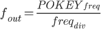
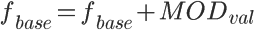
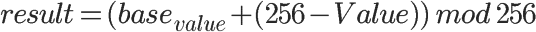
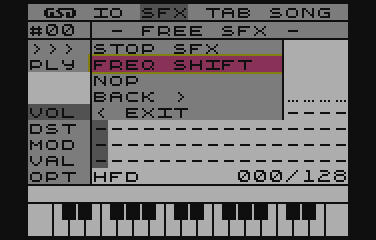
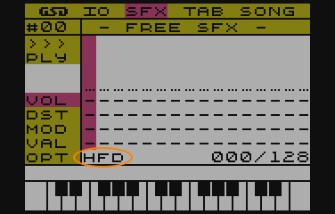

# Modulation types

This is the result of implementing @marok's inspiration, which allows you to specify for a single SFX how, the MOD/VAL value will be taken into account

I took this direction and created definitions for four modes:

- *HFD - High Frequency Divider*.
- *MFD - Middle Frequency Divider*
- *LFD/NLM - Low Frequency Divider/Note Level Modulation*
- *DSD - Direct Set Divider*

## What do they mean?

### HFD - High Frequency Divider
A wide spectrum of frequency divider modulation in the +/-127 range.  
No SFX looping possible  
Full backwards compatibility with the original SFX engine

### MFD - Middle Frequency Divider
Middle Modulation Spectrum.  
Modulation range +/-64 from the sound base  
SFX loopable

### LFD - Low Frequency Divider
Low modulation spectrum.  
Modulation range +/-32 from the sound base.  
SFX loopable.

### NLM - Note Level Modulation
Note level modulation (half tones)  
Modulation range +/-32 semitones with reference to the base note (the one placed in the TAB)  
SFX looping possible

### DSD - Direct Set Divider
Direct frequency divider value.  
Range from 0 to 255  
No looping possible.  
Fixed maximum SFX length (128 envelope points)

## What is meant by the terms frequency divider and modulation?

## Frequency divider

This is the second parameter of the SOUND instruction in Basic. It is responsible for the pitch of the sound generated by POKEY. The higher this value is, the lower the frequency is, according to the formula:

~~~
f_out - output frequency
POKEY_freq - value of the base frequency of POKEY (given channel)
freq_div - value of the frequency divider
~~~

### And why modulation?

The value of the frequency divider will be changed, through the MOD/VAL parameter. For the most part, this modulation is relatively based, i.e. for a base value specified in TAB (be it a note or a direct value of the divider) its value is changed by the value of the MOD/VAL parameter, which can take positive and negative values. Finally, the resulting value becomes the base value.

## MOD/VAL definitions

For each type of modulation, there are different forms of its notation and interpretation. This is best represented by binary notation, where it is clear which bits correspond to functions and which to values.

Thus, for:

### High Frequency Modulation

~~~
%00000000 - no modulation (blank)
%0xxxxxxx - increase the frequency divider by the value specified in bits 'x'
%1xxxxxxx - decrease the frequency divider by the value specified in bits 'x'
%10000000 - End Of SFX definition
~~~

### Middle Frequency Modulation

~~~
%00000000 - no modulation
%00xxxxxx - raise the frequency divider by the value 'x'
%01xxxxxx - decrease frequency divider by the value 'x'
%1xxxxxxx - jump to position specified in 'x' bits (within SFX)
%10000000 - end of SFX definition
~~~

### Low Frequency Modulation/Note Level Modulation

~~~
%00000000 - no modulation
%000xxxxx - raise the frequency divider by the value 'x'
%001xxxxx - Decrease frequency divider by the value 'x'
%010xxxxx - raise a note by 'x' semitones*.
%011xxxxx - lower the note by 'x' semitones*.
%1xxxxxxx - jump to position specified in 'x' bits (within SFX)
%10000000 - end of SFX definition
~~~

### Direct Set Divider

~~~
%xxxxxxxx - direct value of the frequency divider register
~~~

## Important things

### Negative value notation

Negative value must be VAL=255-VAL (opposite number)

This is required because subtraction is based on addition modulo 256.

Subtraction is adding opposite number to the base value.
The 8-bit register used gets overflowed, which is ignored, and the result of the register is smaller by the VAL value.

### JUMP TO function

In each case, using the `JUMP TO` function will perform a jump to the specified position in the definition, however, volume setting and distortion information will be ignored.

## Modulation in the program

In the SFX editing module, typing in values directly is "slightly" cumbersome, hence the convenience that has been taken from the TAB editing module.
When you go to edit the SFX envelope, select the item of interest with the __LEFT/RIGHT__ arrow keys and press the __RETURN__ key, a list of available MOD/VAL functions will open.

This list, will vary depending on the modulation mode (see section Determining modulation type)

The option that is at the location of the edit cursor is automatically selected. This is to make it easier to change the value of the current function.

After selecting one of the options, you will be prompted (at the bottom of the screen - above the piano keyboard) to enter a value for the selected function - the range of this value will be displayed on the screen.

After accepting with the __RETURN__ key, the program will process the entered information into MOD/VAL values.

## Determining the modulation type

The modulation mode is shown in the lower left corner of the SFX edit screen as an acronym (the first letters of the words)

The modulation type can be changed by selecting __SFX->OPT->SET MOD MODE__.

 

A list of available modes will appear from which you can select by using the __UP/DOWN__ arrow keys and accepting with the __RETURN__ key. When the list opens, the currently set modulation mode for the currently edited SFX will be selected.

## Summary

This kind of editing is not the most comfortable for very complex SFXs, so there will probably be a program with which this can be done in a more visually accessible way.
