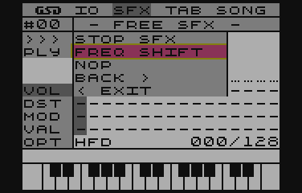
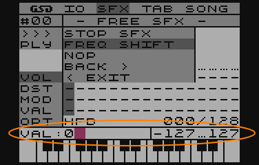
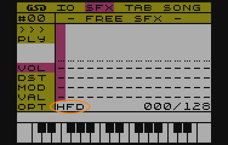
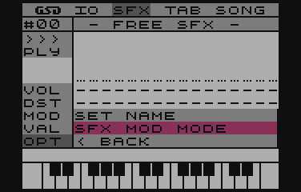
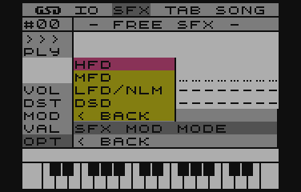

# Rodzaje modulacji

Jest to efekt wdrożenia inspiracji @marok, która pozwala na ustalenie dla pojedynczego SFXa w jaki sposób, będzie brana pod uwagę wartość MOD/VAL

Obrałem ten kierunek i utworzyłem definicje czterech trybów:

- *HFD - High Frequency Divider*
- *MFD - Middle Frequency Divider*
- *LFD/NLM - Low Frequency Divider/Note Level Modulation*
- *DSD - Direct Set Divider*

## Co one oznaczają?

### HFD - High Frequency Divider
Szerokie spektrum modulacji dzielnika częstotliwości w zakresie +/-127.
Nie ma możliwości zapętlenia SFXa
Pełna zgodność wsteczna z pierwotnym silnikiem SFX

### MFD - Middle Frequency Divider
Średnie spektrum modulacji.
Zakres modulacji +/-64 od podstawy dźwięku
Możliwość zapętlenia SFXa

### LFD - Low Frequency Divider
Niskie spektrum modulacji.
Zakres modulacji +/-32 od podstawy dźwięku.
Możliwość zapętlenia SFXa

### NLM - Note Level Modulation
Modulacja na poziomie nuty (pół tonów)
Zakres modulacji +/-32 pół tony w odniesieniu do nuty bazowej (tej umieszczonej w TABie)
Możliwość zapętlenia SFX

### DSD - Direct Set Divider*
Bezpośrednia wartość dzielnika częstotliwości.
Zakres od 0 do 255
Brak możliwości zapętlenia.
Stała, maksymalna długość SFXa (128 punktów obwiedni)

## Co kryje się pod pojęciami: dzielnik częstotliwości oraz modulacja?
###Dzielnik częstotliwości
Jest to drugi parametr instrukcji SOUND w Basicu. Jest ona odpowiedzialna za wysokość generowanego przez POKEY dźwięku. Im ta wartość jest większa, tym częstotliwość jest niższa, zgodnie ze wzorem:

fOut=POKEY_freq/FreqDiv

~~~
fOut - częstotliwość wyjścowa
POKEY_freq - wartość podstawy częstotliwości pracy POKEYa (danego kanału)
FreqDiv - wartość dzielnika częstotliwości
~~~

### A dlaczego modulacja?
Wartość dzielnika częstotliwości będzie ulegała zmianom, poprzez parametr MOD/VAL. W większości, modulacja ta odbywa się względnie, tzn. dla wartość bazowej określanej w TAB (niezależnie, czy będzie to nuta, czy też wartość bezpośrednia dzielnika) jej wartość jest zmieniana o wartość parametru MOD/VAL, która może przyjmować wartości dodatnie oraz ujemne. Ostatecznie, wartość wynikowa staje się wartością bazową.

base_freq=base_freq+MODVal

## Definicje MOD/VAL
Dla poszczególnych rodzajów modulacji, istnieją różne formy jej zapisu i interpretacji. Najlepiej to przedstawi zapis binarny, gdzie wyraźnie widać, jakie bity odpowiadają za funkcje, a jakie za wartość.

I tak, dla:

### High Frequency Modulation

~~~
%00000000 - brak modulacji (blank)
%0xxxxxxx - zwiększenie dzielnika częstotliwości o wartość określoną w bitach 'x'
%1xxxxxxx - zmniejszenie dzielnika częstotliwości o wartość określoną w bitach 'x'
%10000000 - koniec definicji SFX (End Of SFX)
~~~

### Middle Frequency Modulation

~~~
%00000000 - brak modulacji
%00xxxxxx - zwiększenie dzielnika częstotliwości o wartość 'x'
%01xxxxxx - zmniejszenie dzielnika częst. o wartość 'x'
%1xxxxxxx - skok do pozycji określonej w bitach 'x' (w obrębie SFXa)
%10000000 - koniec definicji SFX
~~~

### Low Frequency Modulation/Note Level Modulation*

~~~
%00000000 - brak modulacji
%000xxxxx - zwiększenie dzielnika częst. o wartość 'x'
%001xxxxx - zmniejszenie dzielnika częst. o wartość 'x'
%010xxxxx - podniesienie nuty o 'x' półtonów*
%011xxxxx - obniżenie nuty o 'x' półtonów*
%1xxxxxxx - skok do pozycji określonej w bitach 'x' (w obrębie SFXa)
%10000000 - koniec definicji SFX
~~~

### Direct Set Divider

~~~
%xxxxxxxx - wartość bezpośrednia rejestru dzielnika częstotliwości
~~~

## Modulacja w programie

W module edycji SFX, wpisywanie wartości w sposób bezpośredni jest "nieco" kłopotliwe, stąd ułatwienie, które zostało zaczerpnięte z modułu edycji TAB.
Po przejściu do edycji obwiedni SFXa, wyborze interesującej pozycji klawiszami strzałek __LEWO/PRAWO__ i naciśnięciu klawisza __RETURN__, zostanie otwarta lista dostępnych funkcji MOD/VAL.

Lista ta, będzie się różnić w zależności od trybu modulacji (patrz pkt. Ustalanie rodzaju modulacji)

Automatycznie zaznaczana jest opcja, która jest w miejscu kursora edycji. To ma na celu ułatwienie dokonywania zmian wartości aktualnej funkcji.

Po wybraniu jednej z opcji, wyświetlony zostanie monit (w dolnej częsci ekranu - nad klawiaturą pianina) o podanie wartości dla wybranej funkcji - zakres tej wartości zostanie wyświetlony na ekranie.

Po zaakceptowaniu klawiszem __RETURN__, program przetworzy wprowadzone informacje do wartości MOD/VAL.

## Ustalenie rodzaju modulacji

Tryb modulacji przedstawiony jest w lewym dolnym rogu ekranu edycji SFXa w postaci skrótu (pierwszych liter wyrazów)

Rodzaj modulacji można zmienić, wybierając __SFX->OPT->SET MOD MODE__.

 

Pokaże się lista dostępnych trybów z których można wybierać, używając klawiszy strzałek __GÓRA/DÓŁ__ i akceptując klawiszem __RETURN__. Po otwarciu listy, zaznaczony zostanie aktualnie ustawiony tryb modulacji dla aktualnie edytowanego SFXa.

## Podsumowanie

Taka edycja nie jest najbardziej komfortowa dla bardzo złożonych SFXów, więc zapewne pojawi się program, którym będzie można to czynić w sposób bardziej przystępny wizualnie.
